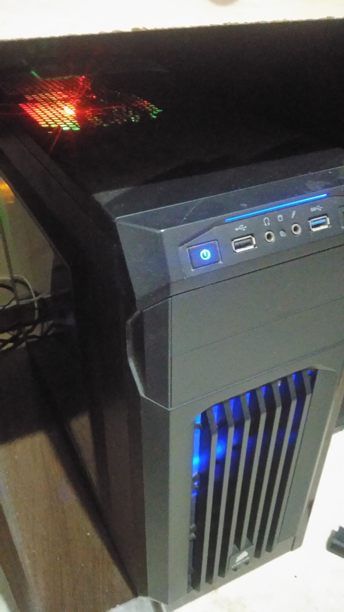

TOP500 & me: Comparativo de Arquiteturas Paralelas
--------------------------------------------------

Nome: Miguel Mazuim da Silva

Foi escolhido o computador na posição 30 da lista de novembro de 2019, o Barcelona Supercomputing Center.

| Característica                                            | Computador no TOP500  | Meu computador  |
| --------------------------------------------------------- | --------------------- | --------------- |
| Nome/Título                                               | Barcelona Supercomputing Center| Meu computador  |
| Imagem (foto, diagrama, screenshot, etc.)                 |  | Substitua-me. |
| Classificação de Flynn                                    |                       |                 |
| Memória: compartilhada, distribuída ou ambas?             |                       |                 |
| Número total de núcleos de processamento                  |                       |                 |
| Fabricante e modelo do(s) processador(es)                 |                       |                 |
| Frequência do(s) processador(es)                          |                       |                 |
| Memória total                                             |                       |                 |
| Tipo(s) de interconexão entre os núcleos/processadores    |                       |                 |
| Desempenho Linpack                                        |                       |                 |

### Referências
- Complete aqui: Autor (nome de pessoa ou instituição). Título. URL.
