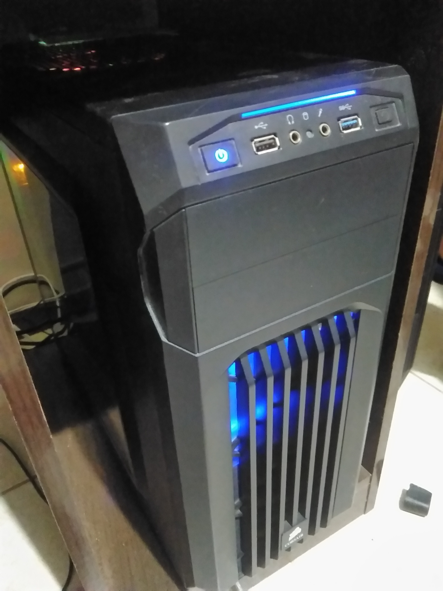

TOP500 & me: Comparativo de Arquiteturas Paralelas
--------------------------------------------------

Nome: Miguel Mazuim da Silva

Foi escolhido o computador na posição 30 da lista de novembro de 2019, o MareNostrum da Barcelona Supercomputing Center.
Para o desempenho limpack, foi utilizado Linpack Extreme com a versão 1.1.2.

| Característica                                            | Computador no TOP500  | Meu computador  |
| --------------------------------------------------------- | --------------------- | --------------- |
| Nome/Título                                               | MareNostrum | Meu computador  |
| Imagem (foto, diagrama, screenshot, etc.)                 |  ||
| Classificação de Flynn                                    |MIMD                  |MIMD             |
| Memória: compartilhada, distribuída ou ambas?             |Ambas                 | Compartilhada   |
| Número total de núcleos de processamento                  |153,216 núcleos        |12 núcleos lógicos(6 núcleos físicos)|
| Fabricante e modelo do(s) processador(es)                 | Intel Xeon Platinum 8160 24C | AMD Ryzen 5 3600                 |
| Frequência do(s) processador(es)                          |2.1GHz                        |4GHz                 |
| Memória total                                             | 384.75 TB                    | 16GB                |
| Tipo(s) de interconexão entre os núcleos/processadores    |                       |                 |
| Desempenho Linpack                                        | 6,470.8 TFlop/s                       |177 GFlop/s                 |

### Referências
