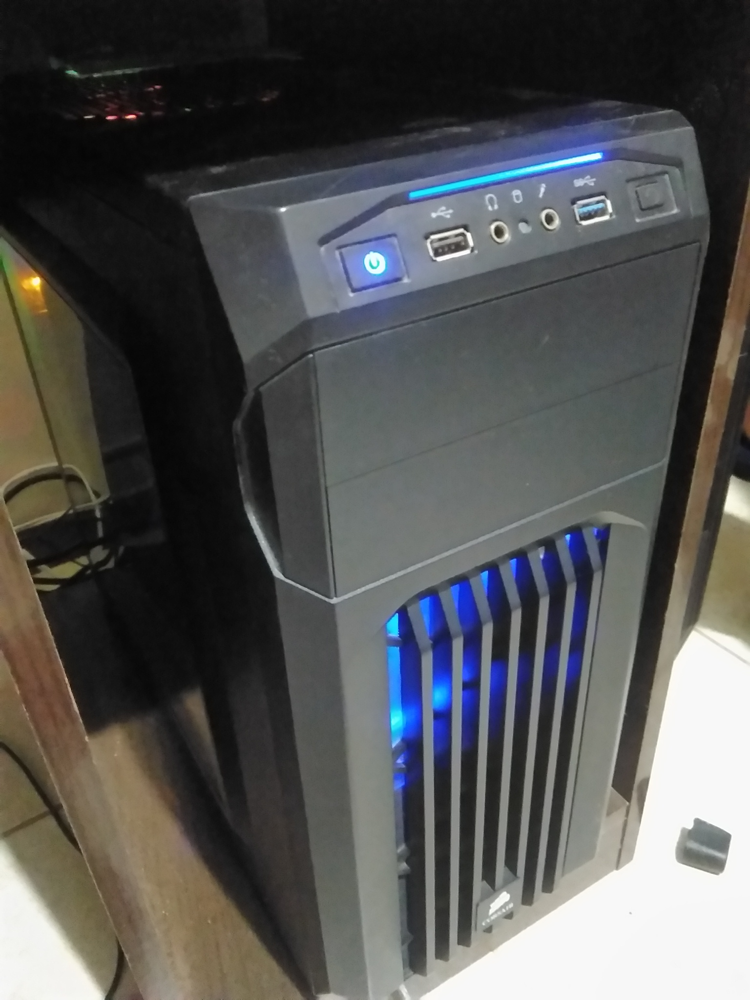
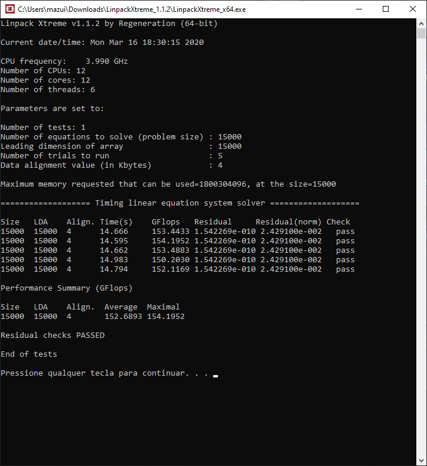
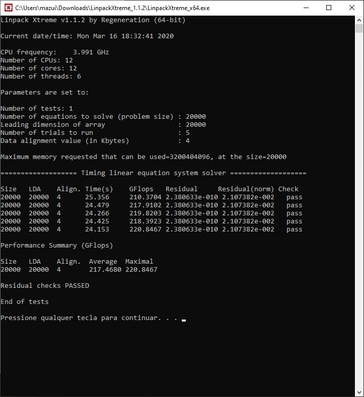
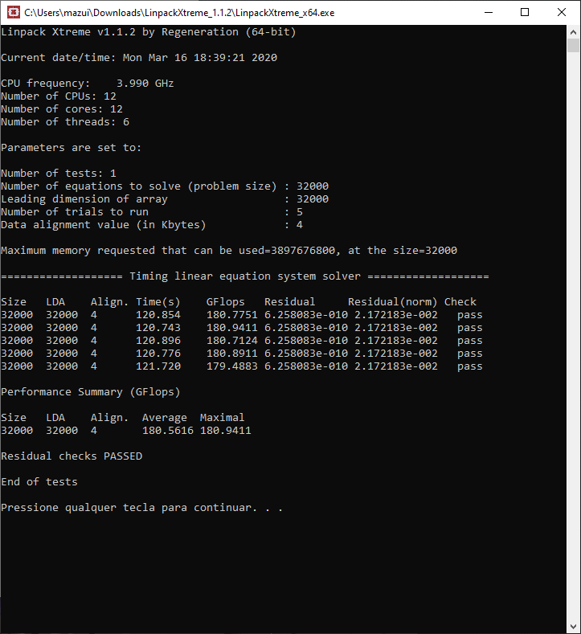

TOP500 & me: Comparativo de Arquiteturas Paralelas
--------------------------------------------------

Nome: Miguel Mazuim da Silva

Foi escolhido o computador na posição 30 da lista de novembro de 2019, o MareNostrum da Barcelona Supercomputing Center.

Para o desempenho linpack, foi utilizado Linpack Extreme com a versão 1.1.2.

| Característica                                            | Computador no TOP500  | Meu computador  |
| --------------------------------------------------------- | --------------------- | --------------- |
| Nome/Título                                               | MareNostrum                 | Meu computador  |
| Imagem (foto, diagrama, screenshot, etc.)                 |  ||
| Classificação de Flynn                                    |MIMD                         |MIMD             |
| Memória: compartilhada, distribuída ou ambas?             |Ambas                        |Compartilhada    |
| Número total de núcleos de processamento                  |153,216 núcleos              |12 núcleos lógicos(6 núcleos físicos)|
| Fabricante e modelo do(s) processador(es)                 |Intel Xeon Platinum 8160 24C | AMD Ryzen 5 3600 | 
| Frequência do(s) processador(es)                          |2.1GHz                       |4 GHz            |
| Memória total                                             |331,776 GB                   |16 GB            |
| Tipo(s) de interconexão entre os núcleos/processadores    |Intel Omni-Path              |Infinity Fabric  |
| Desempenho Linpack                                        | 6,470.8 TFlop/s             |180 GFlop/s      |

Na ferramenta Linpack Xtreme existia 3 opções de benchmark:

-Utilizando o teste de 2GB de memória:

-Utilizando o teste de 3GB de memória:

-Utilizando o teste de 8GB de memória:

### Referências

- AMD Ryzen 5 3600 specifications. http://www.cpu-world.com/CPUs/Zen/AMD-Ryzen%205%203600.html
- TOP500 MareNostrum - Lenovo SD530, Xeon Platinum 8160 24C 2.1GHz, Intel Omni-Path. https://www.top500.org/system/179067
- Ferramenta Usada: https://www.techpowerup.com/download/linpack-xtreme/
